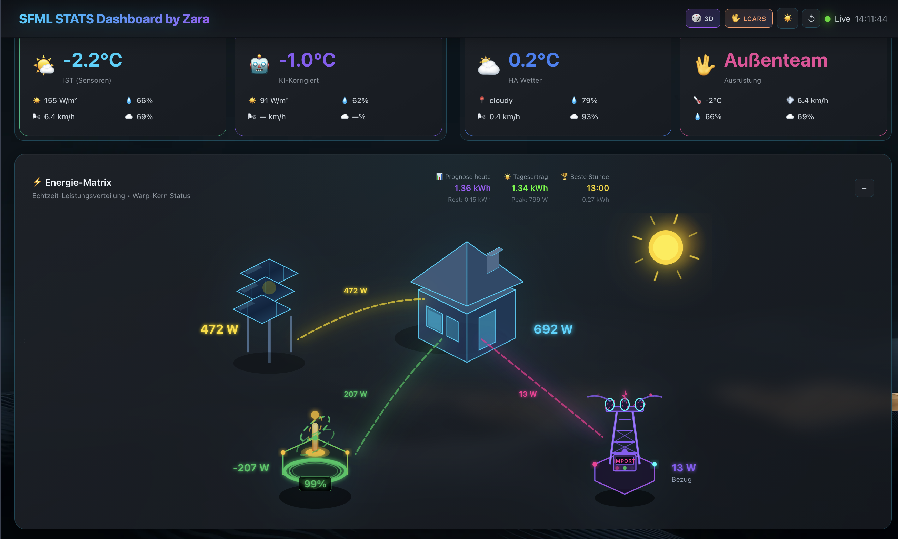
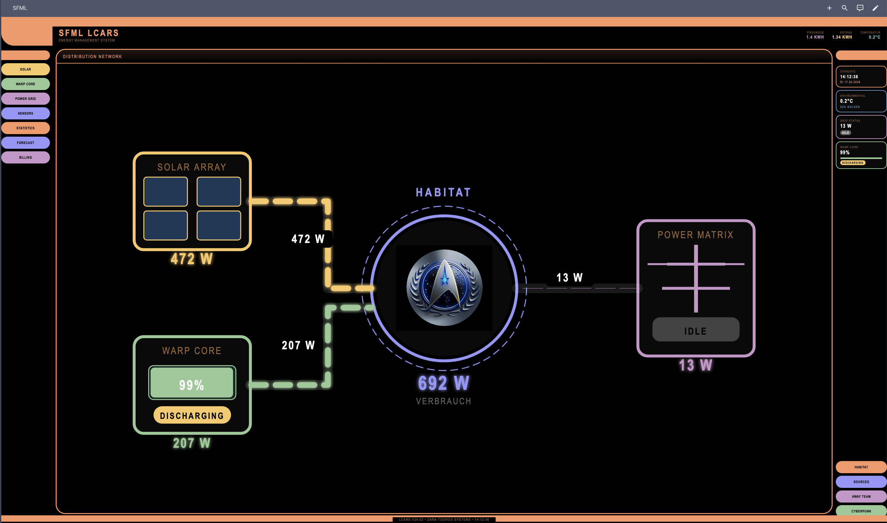
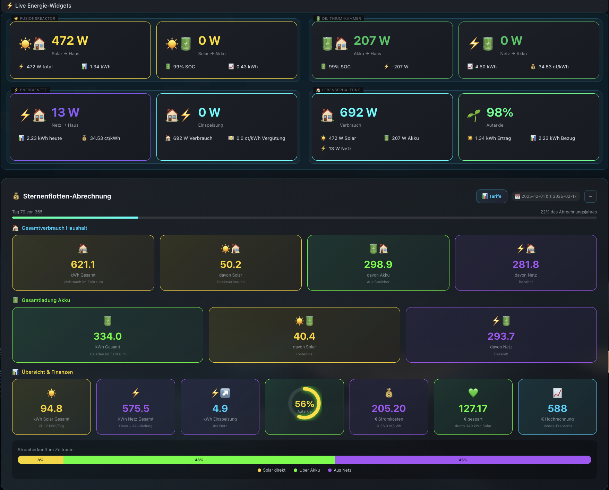
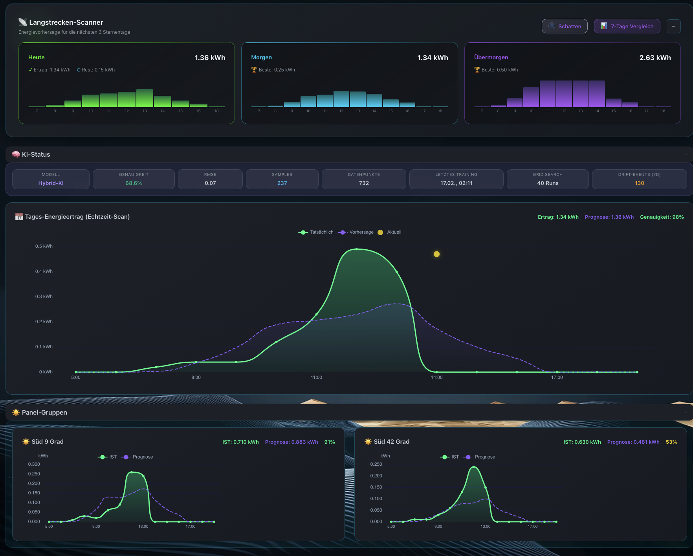

<p align="center">
  
</p>

<h1 align="center">SFML Stats — Energy-Dashboard V14 "Developer-Version"</h1>

<p align="center">
  <strong>Comprehensive Energy Monitoring Dashboard for Home Assistant — Charts, Reports & Real-Time Flows</strong>
</p>

<p align="center">
  <a href="https://github.com/Zara-Toorox/sfml_stats"></a>
  <a href="https://hacs.xyz/"></a>
  <a href="LICENSE"></a>
  
</p>

A powerful dashboard that visualizes solar production, battery storage, grid consumption, and energy costs in real-time. Designed to work seamlessly with [Solar Forecast ML](https://github.com/Zara-Toorox/ha-solar-forecast-ml) and [Grid Price Monitor](https://github.com/Zara-Toorox/ha-solar-forecast-ml/tree/main/custom_components/solar_forecast_ml/extra_features/grid_price_monitor) for the ultimate energy management experience.

**Fuel my late-night ideas with a coffee? I'd really appreciate it — keep this project running!**

<a href='https://ko-fi.com/Q5Q41NMZZY' target='_blank'></a>

---

## What Makes This Dashboard Special?


SFML Stats Dashboard provides a unified view of your entire energy ecosystem. It turns raw sensor data into beautiful, actionable insights — from real-time power flows to automated weekly and monthly reports. Everything runs locally on your Home Assistant instance, with no cloud dependencies.

Part of the **Solar Forecast ML** ecosystem, SFML Stats is the visual companion that brings your energy data to life.

<br clear="both">

---

## Key Features

| Feature | Description |
|---------|-------------|
| **Real-Time Flows** | See exactly where your energy is flowing — from solar panels to battery, house, and grid |
| **Forecast Comparison** | Compare actual production against Solar Forecast ML predictions |
| **Cost Tracking** | Monitor energy costs with fixed or dynamic pricing (EEG support) |
| **Automated Reports** | Generate beautiful weekly and monthly charts automatically |
| **Multi-String Support** | Track up to 4 separate panel groups individually |
| **Weather Correlation** | Overlay weather data on your energy charts |
| **Monthly Tariffs** | Track and manage monthly energy tariffs with EEG support |
| **Power Sources** | Detailed stacked area visualization of energy sources |
| **LCARS Theme** | Star Trek-inspired interface for the true fan |
| **Clothing Recommendation** | Weather-based clothing suggestions for the day |

---

## Screenshots

### Energy Flow Dashboard
Real-time visualization of your complete energy ecosystem — solar, battery, house, and grid with animated power flow lines.



### LCARS Theme
Star Trek-inspired LCARS interface with full energy monitoring — Solar Array, Warp Core (Battery), Habitat (House), and Power Matrix (Grid).



### Developer Version — Energy Widgets
Full energy widget display with live power values, Starfleet billing overview, and financial summary (requires Developer PIN).



### Developer Version — AI & Forecast Display
Long-range forecast scanner, AI status, daily energy curve with forecast comparison, and per-panel group analytics (requires Developer PIN).



---

## Important Compatibility Notes

> **Warning**
> This integration does NOT work on:
> - **Raspberry Pi** — Due to performance limitations with matplotlib chart generation
> - **Proxmox VE** — When Home Assistant runs directly on Proxmox (VMs/LXC containers on Proxmox are fine)

**Recommended platforms:**
- Intel NUC or similar x86 hardware
- Virtual machines with adequate resources (4GB+ RAM)
- LXC containers on Proxmox with sufficient allocation
- Home Assistant OS on capable hardware

---

## Installation

### HACS (Recommended)

1. HACS > Integrations > Custom repositories
2. Add `https://github.com/Zara-Toorox/sfml_stats` (Integration category)
3. Install **SFML Stats**
4. Restart Home Assistant
5. Go to Settings > Devices & Services > Add Integration > SFML Stats

### Manual Installation

1. Download the latest release
2. Copy the `sfml_stats` folder to `custom_components/` in your Home Assistant config directory
3. Restart Home Assistant
4. Go to Settings > Devices & Services > Add Integration > SFML Stats

---

## Sensor Configuration Guide

### General Notes

All sensors are optional. The integration works with incomplete configuration but will only display available data.

Power sensors can be specified in Watts (W) or Kilowatts (kW). The integration detects the unit automatically. Energy sensors should be in Kilowatt-hours (kWh).

### Step 1: Basic Settings

No sensors required. Configuration options for automatic chart generation and color theme selection.

### Step 2: Energy Flow Sensors

| Sensor | Unit | Description |
|--------|------|-------------|
| `sensor_solar_power` | W | Current total PV output |
| `sensor_solar_to_house` | W | Solar power consumed directly |
| `sensor_solar_to_battery` | W | Solar power flowing into battery |
| `sensor_grid_to_house` | W | Power drawn from grid |
| `sensor_grid_to_battery` | W | Grid power charging battery |
| `sensor_house_to_grid` | W | Power fed into grid |
| `sensor_smartmeter_import` | kWh | Total grid consumption (smart meter) |
| `sensor_smartmeter_export` | kWh | Total export (smart meter) |

### Step 3: Battery Sensors

| Sensor | Unit | Description |
|--------|------|-------------|
| `sensor_battery_soc` | % | Battery state of charge |
| `sensor_battery_power` | W | Charging/discharging power |
| `sensor_battery_to_house` | W | Discharge power to house |
| `sensor_battery_to_grid` | W | Discharge power to grid |
| `sensor_home_consumption` | W | Total household consumption |

### Step 4: Statistics Sensors

| Sensor | Unit | Description |
|--------|------|-------------|
| `sensor_solar_yield_daily` | kWh | Daily PV yield (midnight reset) |
| `sensor_grid_import_daily` | kWh | Daily grid consumption |
| `sensor_grid_import_yearly` | kWh | Yearly grid consumption |
| `sensor_battery_charge_solar_daily` | kWh | Daily battery charge from solar |
| `sensor_battery_charge_grid_daily` | kWh | Daily battery charge from grid |
| `sensor_price_total` | EUR | Total cost for grid consumption |
| `weather_entity` | — | Weather entity for chart annotations |

### Step 5: Panel Sensors (up to 4 groups)

| Sensor | Unit | Description |
|--------|------|-------------|
| `panel_name` | Text | Custom name (e.g., South, East) |
| `sensor_panel_power` | W | Current string power output |
| `sensor_panel_max_today` | W | Peak power reached today |

### Step 6: Billing

No sensors required. Configure billing period start, price mode (dynamic/fixed), and feed-in tariff.

---

## Practical Tips

### Creating Missing Sensors

**Daily counters:** Use the Utility Meter helper with daily reset.
**Maximum values:** Use the Statistics helper with the Maximum function.
**Calculated values:** Create a Template sensor.

### Typical Sensor Sources

| Manufacturer | Integration |
|--------------|-------------|
| Fronius | Native integration |
| SMA | Modbus or SMA Energy Meter |
| Huawei | FusionSolar or Modbus |
| Kostal | Piko or Plenticore |
| Growatt | Growatt Server |
| Sungrow | Modbus |
| Enphase | Envoy integration |

### Template Sensor for Home Consumption

```yaml
template:
  - sensor:
      - name: "Home Consumption"
        unit_of_measurement: "W"
        state: >
          {{ states('sensor.solar_power')|float(0)
             + states('sensor.grid_import')|float(0)
             - states('sensor.grid_export')|float(0) }}
```

---

## Accessing the Dashboard

After installation and configuration:

```
http://YOUR_HOME_ASSISTANT:8123/api/sfml_stats/dashboard
```

Or add it to your sidebar via the Home Assistant configuration.

---

## Requirements

- Home Assistant 2026.3.0+
- x86_64 platform (Intel NUC, VM, LXC)
- ~4GB+ RAM recommended
- Python packages: matplotlib, aiofiles (installed automatically)
- [Solar Forecast ML](https://github.com/Zara-Toorox/ha-solar-forecast-ml) (recommended)

---

## Part of the Solar Forecast ML Ecosystem

| Module | Description | Platform |
|--------|-------------|----------|
| [**Solar Forecast ML**](https://github.com/Zara-Toorox/ha-solar-forecast-ml) | Local Transformer-AI Solar Forecast — 3-day hourly predictions with up to 97% accuracy | x86_64, ARM, RPi |
| **SFML Stats** | Complete energy monitoring dashboard with real-time flows, charts, and reports | x86_64 |
| **Grid Price Monitor** | Dynamic electricity spot prices for DE/AT | All |

---

## Protected Code Notice

Some files in this integration are obfuscated with an official **PyArmor** license to protect proprietary algorithms.

**Protected modules (22 files):**
- `api/` — REST-API endpoints and WebSocket handlers
- `charts/` — All analytics chart generators
- `readers/` — Data readers for solar, price, forecast, and weather data
- `services/` — Billing calculator, daily/hourly aggregation, forecast comparison
- Root-level — Central data reader, power sources collector, clothing recommendation

**Unprotected (cleartext):**
- `__init__.py`, `const.py`, `config_flow.py` — Integration setup and configuration
- `storage/`, `utils/` — Infrastructure and utilities
- `translations/`, `frontend/` — UI resources

The obfuscation has **no impact on functionality**. Runtime overhead is minimal.

### Developer Version

Starting with version 12.0.0, a **Developer Version** is available with full unobfuscated source code. To obtain the Developer PIN, contact:
- **GitHub:** [@Zara-Toorox](https://github.com/Zara-Toorox)

---

## License

Proprietary Non-Commercial — free for personal and educational use. Commercial use and AI training are strictly prohibited. Clear attribution to "Zara-Toorox" is required.

See [LICENSE](custom_components/sfml_stats/LICENSE) for full terms.

---

## Credits

**Developer:** [Zara-Toorox](https://github.com/Zara-Toorox)

**Support:** [Issues](https://github.com/Zara-Toorox/sfml_stats/issues) | [Discussions](https://github.com/Zara-Toorox/sfml_stats/discussions)

---

*Developed with late-night passion and a stiff glass of Grog during Germany's wintertime.*

*SFML Stats — Copyright (C) 2026 Zara-Toorox · Protected with PyArmor 9.2.3*
